## Datos {.smaller}

:::::: columns
::: {.column width="30%"}

:::

:::: {.column width="70%"}
"Una vez que has importado los datos, es una buena idea **ordenarlos**. **Ordenar** los datos significa guardarlos de una manera consistente que haga coincidir la semántica del set de datos con la manera en que está guardado. En definitiva, **cuando tus datos están ordenados, cada columna es una variable y cada fila una observación**. Tener datos ordenados es importante porque si su estructura es consistente, puedes enfocar tus esfuerzos en las preguntas sobre los datos."  

::: {style="text-align: right"}
*"R Para Ciencia de Datos (2a edición)". Hadley Wickham, Mine Cetinkaya-Rundel (Author), Garrett Grolemund.*
:::
::::
::::::

::: {style="text-align: right"}
:::

## Estado inicial

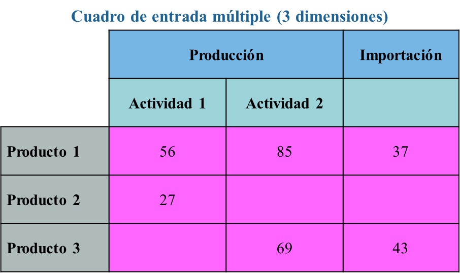

## Paso 1

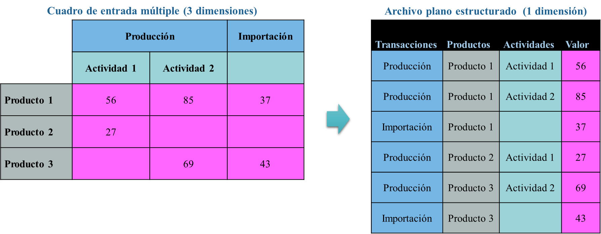

## Paso 2

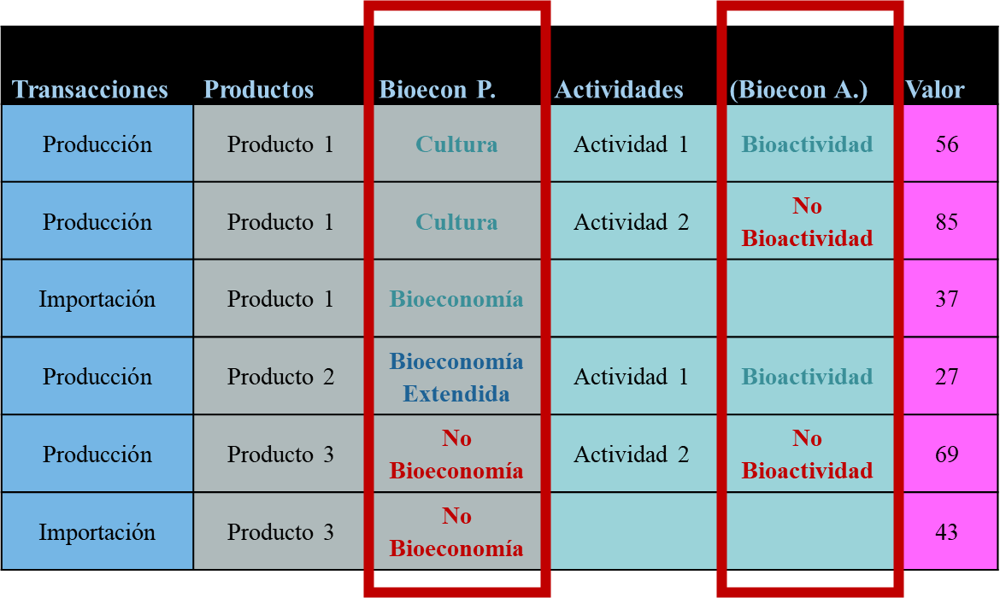

## Paso 3

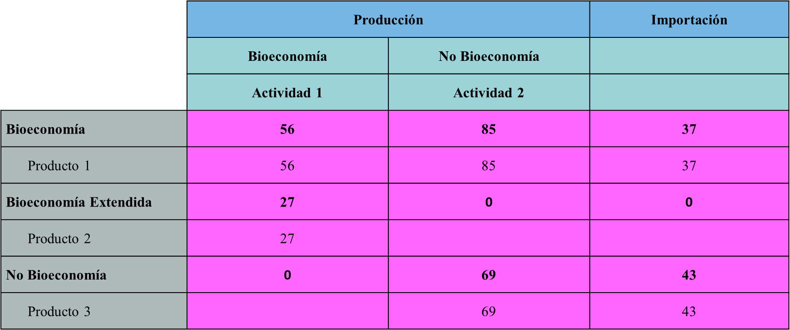

##  {.center}

::: {style="text-align: center"}
Abrir archivo ubicado en:

**"datos/ejemplos"**
:::

## Activar el asistente de Excel

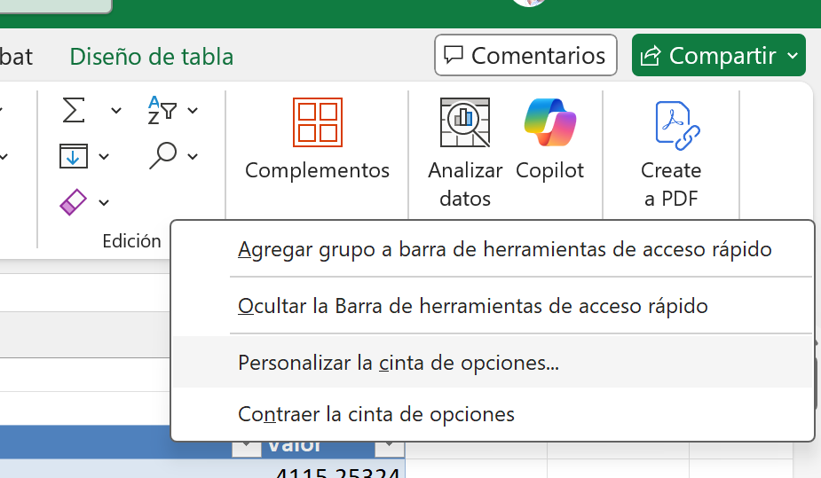

## Todos los comandos

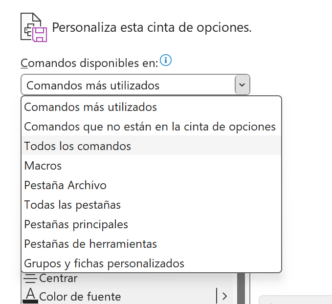

## Nuevo Grupo {.center}

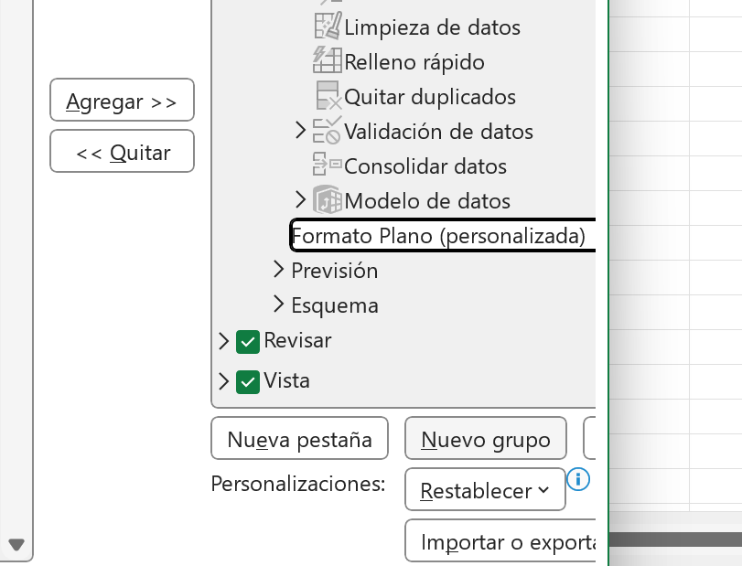

## Agregar "Asistente para tablas y gráficos"

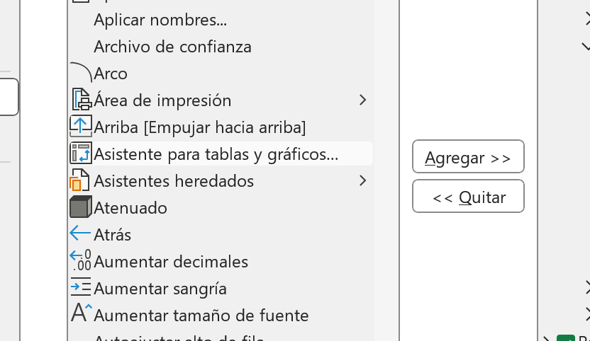

## Rangos de consolidación múltiple

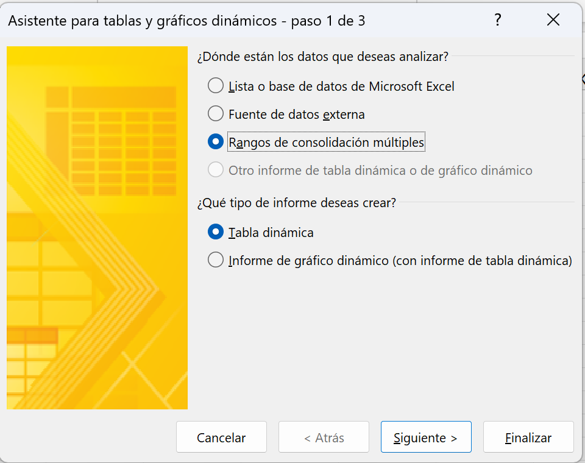

## Campos de página personalizados

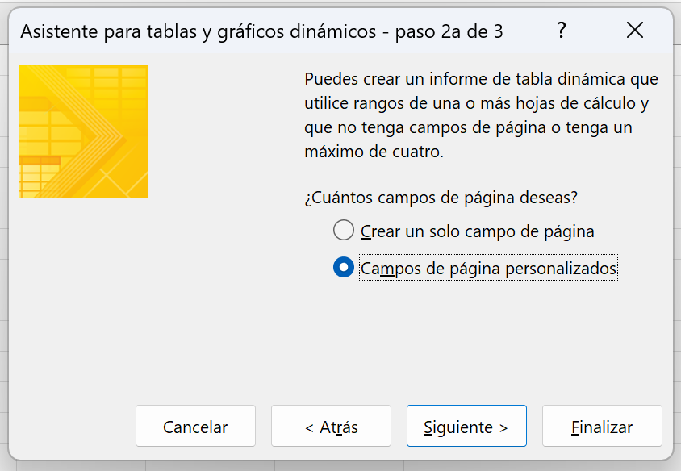

## Seleccionar los datos

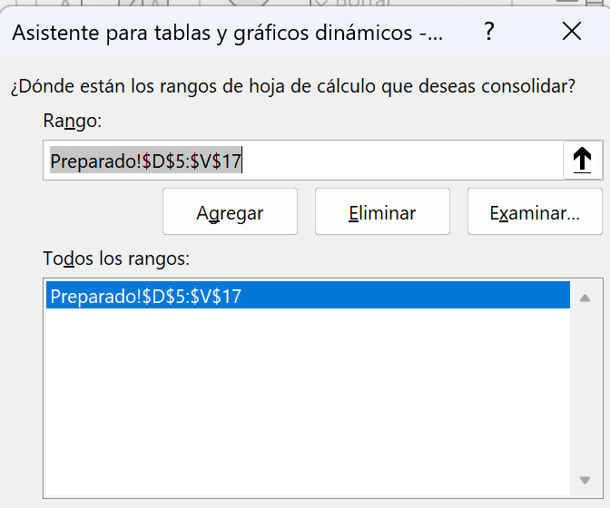

## ¿En dónde?

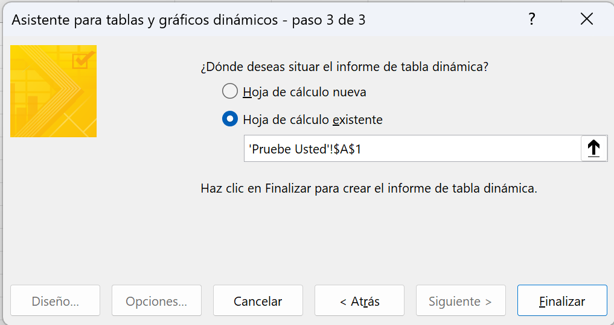

## Eliminar filas y columnas

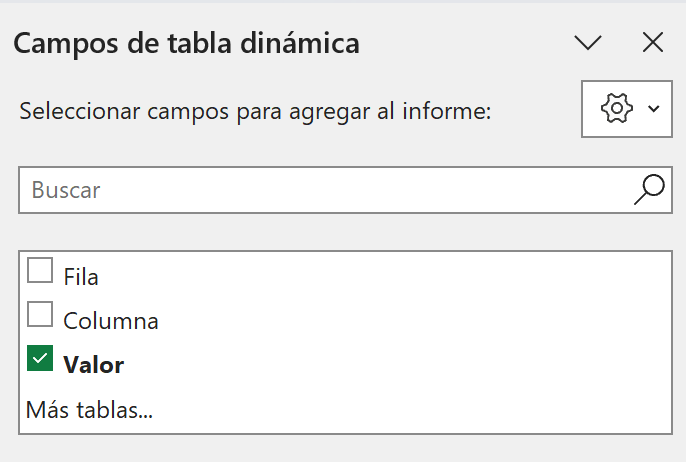

## Doble click en Suma de Valor

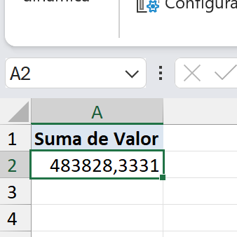

## {.center}

::: {style="text-align: center"}
Gracias

renatovargas.com
:::