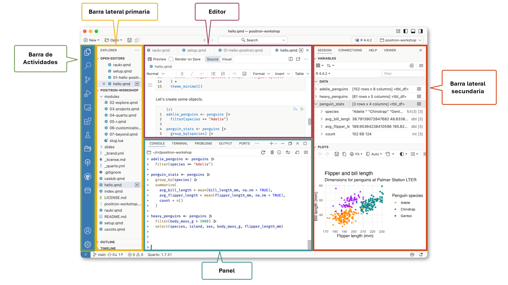

## R {.smaller}

R es un conjunto integrado de herramientas de software para la manipulación de datos, cálculo y visualización gráfica. Incluye:

::: incremental
-   Una eficaz herramienta para el manejo y almacenamiento de datos,
-   Un conjunto de operadores para cálculos en matrices,
-   Una colección grande, coherente e integrada de herramientas intermedias para el análisis de datos,
-   herramientas gráficas para el análisis y visualización de datos, ya sea en pantalla o en copia impresa, y
-   Un lenguaje de programación bien desarrollado, simple y eficaz que incluye condicionales, bucles, funciones recursivas definidas y herramientas para ingreso y salida de información.
-   Un ambiente en el que se han implementado funciones estadísticas.
:::

## Positron {.smaller}

- Positron es un ambiente para trabajar con código (Integrated Development Environment ---IDE---) moderno y con capacidad para ser extendido dirigido al trabajo de ciencia de datos, construido sobre la plataforma de Code OSS (la versión de fuente abierta de Visual Studio Code). Combina el poder de un ambiente de trabajo poderoso con herramientas explícitas para el trabajo de ciencia de datos con R y Python.

## 

## Carpeta para este día

- https://github.com/renatovargas/pa-scn 

##  {.center}

::: {style="text-align: center"}
Gracias

renatovargas.com
:::